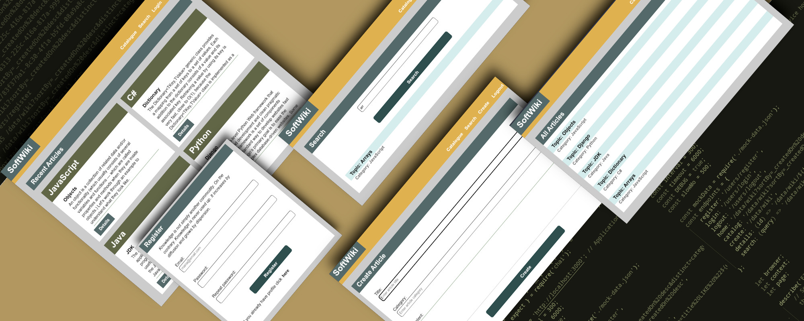

# soft-wiki-SPA

A small wiki app built with page.js and lit-html.
The server from the server folder must be started for the application to work. The app service works with it!
Server docs:
https://github.com/softuni-practice-server/softuni-practice-server

There are also some tests in the tests folder that use playwright/chai/mocha.
